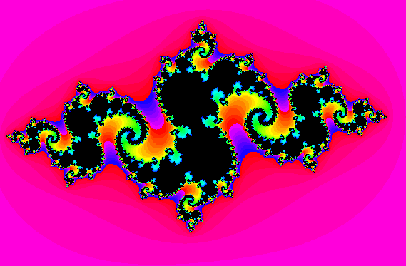
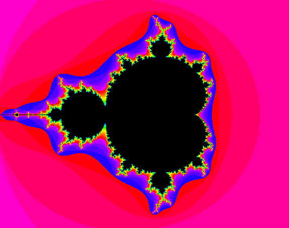
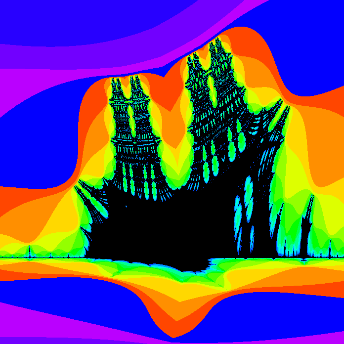
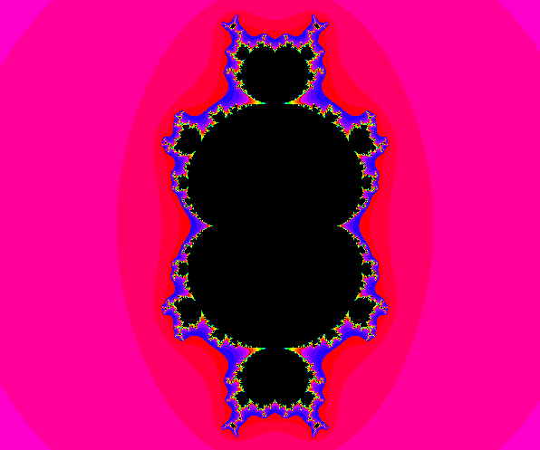
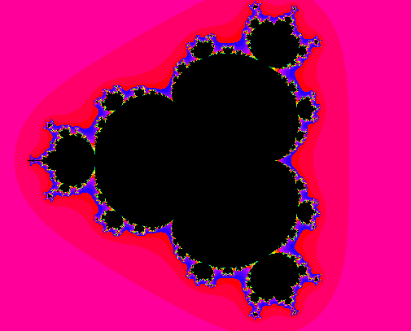
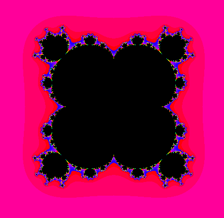
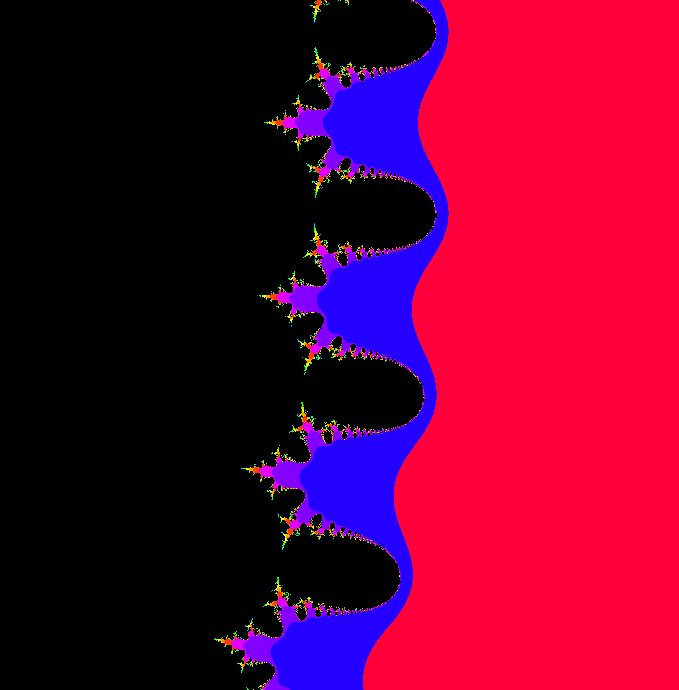
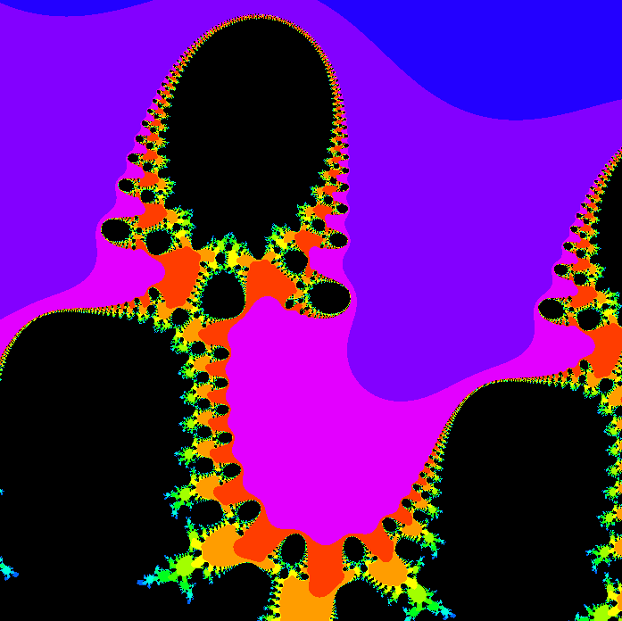
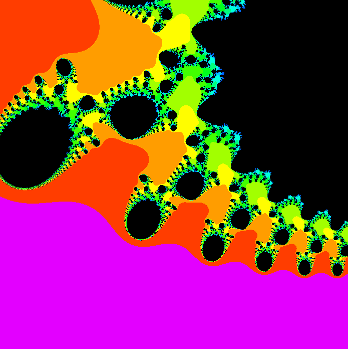

# Fract'ol

First graphic project on 42 cursus

## Download

```shell
git clone --recurse-submodules https://github.com/Elnop/42-Fract-ol.git

make fractol
```

## Start
```shell
./fractol ( julia [C_R, C_I] ) | mandelbrot | burning_ship
```
*C_R: constant real part  
C_I: constant partie imaginary*

## Libs

### MinilibX (linux)

X11 lib wrapper

### Liblp_c

My lib_ft (first project of 42 Scool)

## Controls

- **Molette:** + / - Zoom  
- **Fleches:** move image  
- **Z:** - Iterations  
- **X:** + Iterations  

### Julia

- **Left Clique:**: set constante

#### Mandelbrot

- **O:** - POWER  
- **P:** + POWER

## Preview









