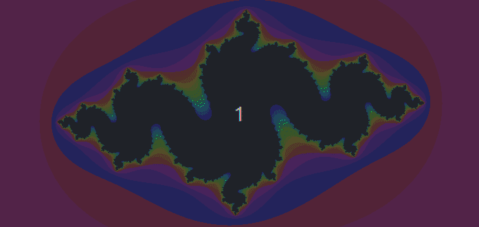
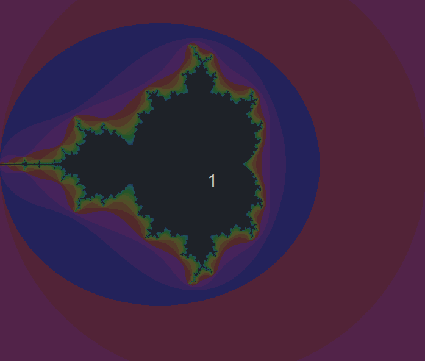
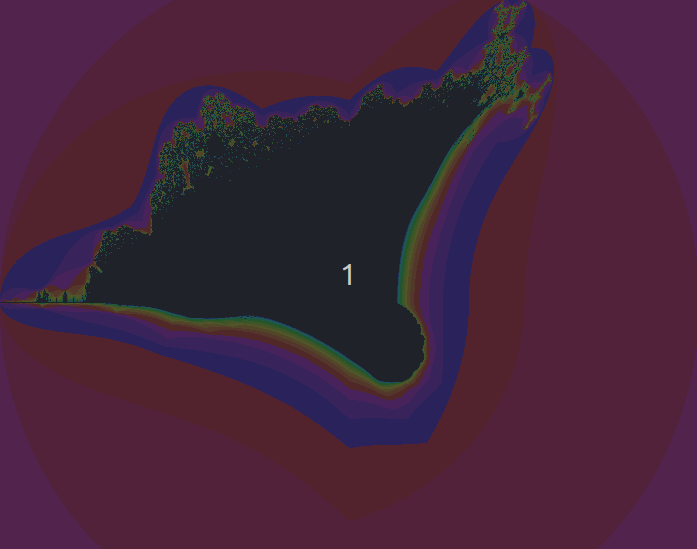

# Fract'ol

First graphic project on 42 cursus

## Download

```shell
git clone --recurse-submodules https://github.com/Elnop/42-Fract-ol.git

make fractol
```

## Start
```shell
./fractol ( julia [C_R, C_I] ) | mandelbrot | burning_ship
```
*C_R: constant real part  
C_I: constant partie imaginary*

## Libs

### MinilibX (linux)

X11 lib wrapper  
[--> repo](https://github.com/42Paris/minilibx-linux/tree/7dc53a411a7d4ae286c60c6229bd1e395b0efb82)
### Liblp_c

My lib_ft (first project of 42 Scool)  
[--> repo](https://github.com/Elnop/liblp_c/tree/71c5582182fd6706b3a9488fe80dd73052b5859e)
## Controls

- **Scroll:** + / - Zoom  
- **Arrows:** move image  
- **Z:** - Iterations  
- **X:** + Iterations  

## Julia

- **Left Click:**: set constante



## Mandelbrot / Multibrot

- **O:** - POWER
- **P:** + POWER



## Burning Ship



